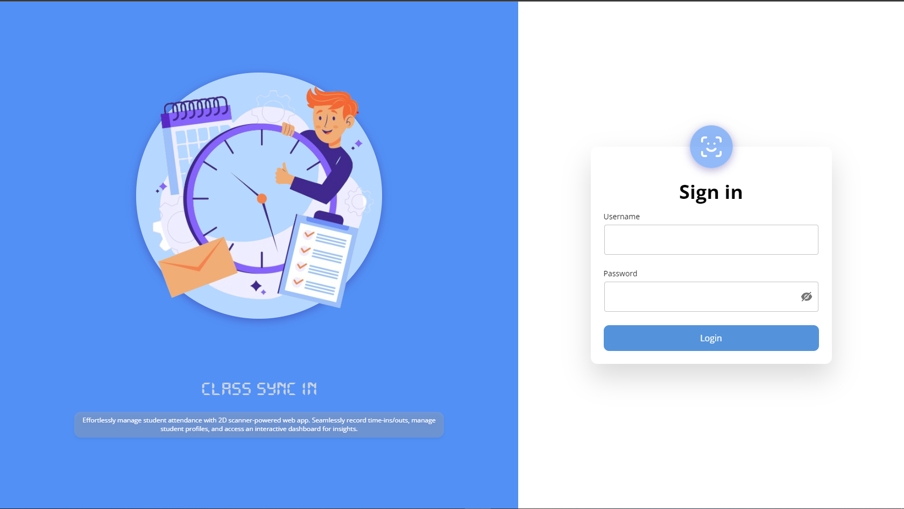
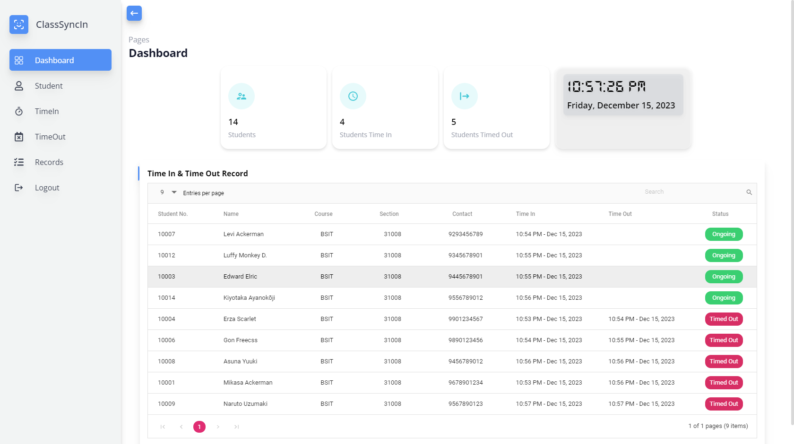

## Class Sync In Web Application (Manage Time in & Time out)

    
    

# Class Sync In

Welcome to Class Sync In! This web application simplifies student attendance tracking in classroom settings.

## Overview

Class Sync In is designed to streamline the process of recording student attendance using a specialized 2D scanner. It offers a user-friendly interface for both educators and students, ensuring a seamless experience.

## Features

- **Efficient Attendance Tracking:** Utilize 2D scanner system for swift and accurate attendance management.
- **Classroom-Focused Design:** Tailored specifically for classroom environments to optimize attendance recording.
- **User-Friendly Interface:** Intuitive design for easy navigation by educators and students alike.
- **Real-time Updates:** Instantly view attendance records and sync data across devices.

## How to Use

1. **Login:** Educators and students can log in using their respective accounts.
2. **Scan QR Code:** Students can scan the provided QR code upon entry to register their attendance.
3. **Attendance Records:** Educators can access and manage attendance records in real-time.

## Installation

### Prerequisites
- Node.js
- MongoDB
- Visual Studio Code
- Git

## License
This project is all rights reserved by Mark Daniel Edillor.

## Contact
For any questions or feedback, feel free to contact me at edillormark2@gmail.com or my Facebook account, Mark Daniel Edillor.
